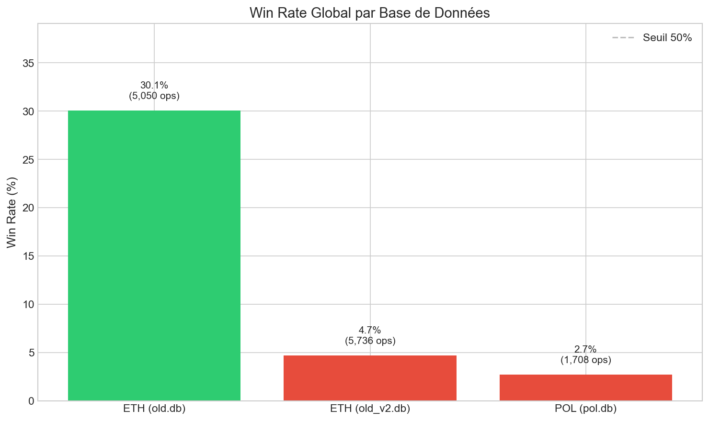
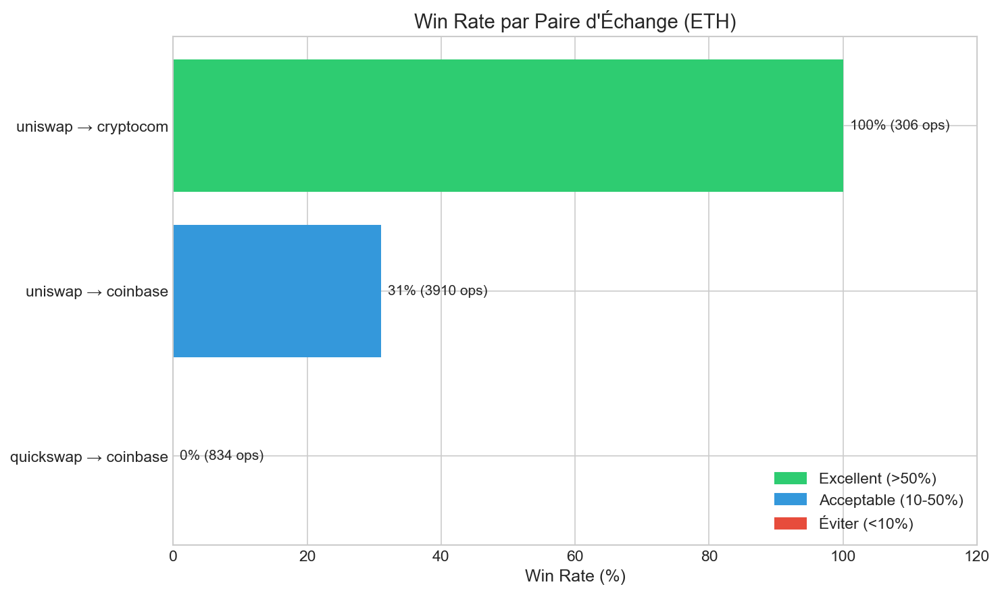
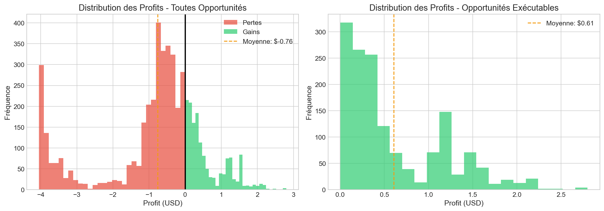
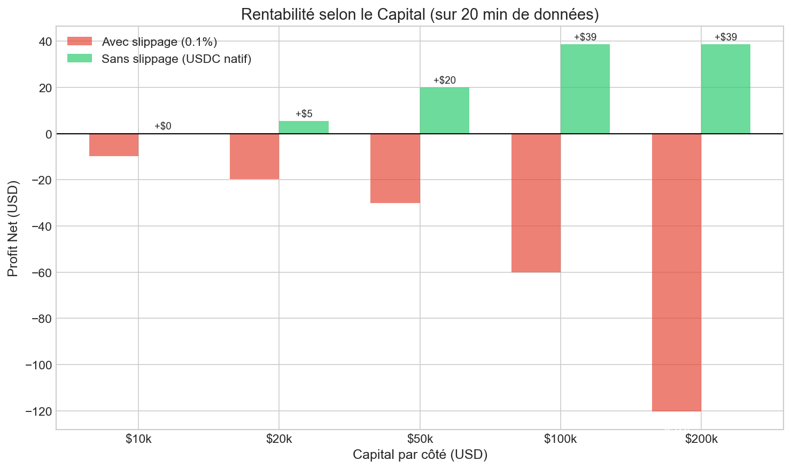

# Étude de Profitabilité - Arbitrage CEX-DEX

**Date de l'étude :** 23 novembre 2025
**Auteur :** Analyse automatisée
**Version :** 1.0

---

## Résumé Exécutif

Cette étude analyse la viabilité d'une stratégie d'arbitrage entre exchanges centralisés (CEX) et décentralisés (DEX) sur le réseau Polygon.

### Conclusions Principales

| Critère | Résultat |
|---------|----------|
| **Rentabilité** | Conditionnellement viable |
| **Capital minimum requis** | $20,000 ($10k par côté) |
| **ROI potentiel (journalier)** | 0.09% à 1.17% selon configuration |
| **ROI potentiel (mensuel)** | 2.7% à 35% |
| **Risque principal** | Coûts de rebalancing vs profits |

### Verdict

La stratégie est **rentable sous conditions strictes** :
- Capital suffisant pour minimiser les rebalancements
- Montant par trade optimisé ($500 recommandé pour $20k de capital)
- Utilisation de USDC natif pour éviter le slippage sur les transferts

---

## 1. Contexte de l'Étude

### 1.1 Qu'est-ce que l'arbitrage CEX-DEX ?

L'arbitrage CEX-DEX consiste à exploiter les différences de prix d'un même actif entre :
- **CEX (Centralized Exchange)** : Plateformes centralisées comme Coinbase ou Crypto.com
- **DEX (Decentralized Exchange)** : Protocoles décentralisés comme Uniswap ou QuickSwap

```
┌─────────────┐                      ┌─────────────┐
│     DEX     │   Prix plus bas      │     CEX     │
│  (Uniswap)  │ ──────────────────►  │ (Coinbase)  │
│             │   Acheter ici        │             │
│  ETH: $3200 │                      │  ETH: $3210 │
└─────────────┘                      └─────────────┘
                    Spread: 0.31%
                    Profit potentiel: $10/ETH
```

### 1.2 Exchanges Analysés

| Type | Exchange | Réseau |
|------|----------|--------|
| DEX | Uniswap V3 | Polygon |
| DEX | QuickSwap | Polygon |
| CEX | Coinbase | - |
| CEX | Crypto.com | - |

### 1.3 Actifs Analysés

| Token | Description |
|-------|-------------|
| **ETH** | Ethereum (wrapped sur Polygon) |
| **POL** | Polygon (anciennement MATIC) |

---

## 2. Données Analysées

### 2.1 Sources de Données

Trois bases de données SQLite contenant les opportunités détectées par le bot de monitoring :

| Base de données | Token | Période | Durée |
|-----------------|-------|---------|-------|
| `opportunities_old.db` | ETH | 22 nov 2025, 20h29-20h49 (Montréal) | 20 min |
| `opportunities_old_v2.db` | ETH | 22 nov 2025, 22h07-22h10 (Montréal) | 3.5 min |
| `opportunities_pol.db` | POL | 23 nov 2025, 02h48-10h41 (Montréal) | 7.9 h |

### 2.2 Volume de Données

| Base | Détections brutes | Opportunités uniques* | Exécutables |
|------|-------------------|----------------------|-------------|
| `opportunities_old.db` | 5,050 | 64 | 1,518 (30%) |
| `opportunities_old_v2.db` | 5,736 | 8 | 269 (4.7%) |
| `opportunities_pol.db` | 1,708 | 1 | 46 (2.7%) |

*\*Opportunités uniques = détections groupées par fenêtre de 5 secondes (une seule transaction possible par fenêtre)*

### 2.3 Structure des Données

Chaque opportunité enregistrée contient :

| Champ | Description |
|-------|-------------|
| `timestamp` | Horodatage de la détection |
| `token` | Token concerné (ETH, POL) |
| `buy_source` | Source d'achat (uniswap, quickswap) |
| `sell_source` | Source de vente (coinbase, cryptocom) |
| `buy_price` | Prix d'achat sur le DEX |
| `sell_price` | Prix de vente sur le CEX |
| `spread_percent` | Écart de prix en % |
| `potential_profit_usd` | Profit net estimé après frais |
| `trade_amount_usd` | Montant de la transaction ($1,000) |
| `executable` | 1 si profitable, 0 sinon |

---

## 3. Méthodologie

### 3.1 Définition d'une Opportunité "Gagnante"

Une opportunité est considérée **gagnante (WIN)** si :

```
Profit Net = (Prix de vente CEX - Prix d'achat DEX) × Quantité - Frais
Profit Net > 0 → WIN
```

**Frais inclus dans le calcul :**
- Frais de trading DEX (~0.3%)
- Frais de trading CEX (~0.5%)
- Frais de gas Polygon (~$0.01-0.05)

### 3.2 Groupement des Détections

Le bot détecte les prix toutes les ~300ms. Une même opportunité peut être détectée **plusieurs fois** avant de disparaître.

**Problème :** 1,518 détections ≠ 1,518 trades possibles

**Solution :** Groupement par fenêtre de 5 secondes, ne gardant que la meilleure opportunité par fenêtre.

| Avant groupement | Après groupement | Réduction |
|------------------|------------------|-----------|
| 1,518 détections | 64 opportunités | 95.8% |

### 3.3 Simulation de Rebalancing

#### Le Problème du Rebalancing

Dans l'arbitrage CEX-DEX avec inventaire des deux côtés :

```
┌─────────────────────────────────────────────────────────┐
│  DÉBUT                                                  │
│  DEX: $10,000 USDC    │    CEX: $10,000 en ETH         │
└─────────────────────────────────────────────────────────┘
                           │
                           ▼ (10 trades de $1,000)
┌─────────────────────────────────────────────────────────┐
│  APRÈS 10 TRADES                                        │
│  DEX: $0 USDC         │    CEX: $0 en ETH              │
│  DEX: +ETH accumulé   │    CEX: +USD accumulé          │
└─────────────────────────────────────────────────────────┘
                           │
                           ▼ REBALANCING NÉCESSAIRE
┌─────────────────────────────────────────────────────────┐
│  Transférer USD du CEX → USDC sur DEX                  │
│  OU                                                     │
│  Transférer ETH du DEX → CEX                           │
│  COÛT: ~$3-13 par rebalancing                          │
└─────────────────────────────────────────────────────────┘
```

#### Coûts de Rebalancing Estimés

| Composant | Coût estimé |
|-----------|-------------|
| Retrait CEX (Coinbase/Crypto.com) | $0.50 - $5.00 |
| Bridge vers Polygon | $0.50 - $2.00 |
| Gas Polygon | $0.01 - $0.05 |
| Slippage (si swap nécessaire) | 0% - 0.1% |
| **Total (sans slippage)** | **~$3.05** |
| **Total (avec 0.1% slippage sur $10k)** | **~$13.05** |

---

## 4. Résultats

### 4.1 Win Rate Global



| Base de données | Win Rate | Interprétation |
|-----------------|----------|----------------|
| **ETH (old.db)** | **30.06%** | Prometteur |
| ETH (old_v2.db) | 4.69% | Faible |
| POL (pol.db) | 2.69% | Très faible |

**Observation :** ETH présente un meilleur potentiel d'arbitrage que POL.

### 4.2 Win Rate par Paire d'Échange (ETH)



| Paire | Win Rate | Profit cumulé | Recommandation |
|-------|----------|---------------|----------------|
| **Uniswap → Crypto.com** | **100%** | $397 | **Prioritaire** |
| Uniswap → Coinbase | 31% | $524 | Acceptable |
| QuickSwap → Coinbase | 0% | -$2,990 | **Éviter** |

**Conclusion :** La paire **Uniswap → Crypto.com** offre le meilleur taux de succès.

### 4.3 Distribution des Profits (ETH)



| Statistique | Valeur |
|-------------|--------|
| Profit minimum | -$4.05 |
| Profit maximum | +$2.80 |
| Profit moyen | -$0.76 |
| Profit médian | -$0.48 |
| **Profit moyen (exécutables)** | **+$0.61** |

### 4.4 Distribution des Spreads (ETH)

| Statistique | Valeur |
|-------------|--------|
| Spread minimum | 0.50% |
| Spread maximum | 1.19% |
| Spread moyen | 0.82% |

**Seuil de rentabilité estimé :** Spread > 0.8% après frais

---

## 5. Simulation de Rentabilité

### 5.1 Impact du Capital



| Capital (par côté) | Trades avant rebal. | Profit brut | Coût rebal. | **Profit NET** |
|-------------------|---------------------|-------------|-------------|----------------|
| $10,000 | 10 | $3.24 | $3.05 | **+$0.19** |
| $50,000 | 50 | $22.99 | $3.05 | **+$19.94** |
| $100,000 | 64 | $38.65 | $0.00 | **+$38.65** |

*Conditions : trades de $1,000, 0% slippage sur transferts*

### 5.2 Impact du Montant par Trade

| Montant/trade | Trades avant rebal. | Profit NET | ROI/jour |
|---------------|---------------------|------------|----------|
| $2,000 | 5 | -$1.29 | -0.60% |
| $1,000 | 10 | +$0.19 | +0.09% |
| **$500** | **20** | **+$2.54** | **+1.17%** |

**Découverte clé :** Des trades plus petits permettent de mieux amortir les coûts fixes de rebalancing.

### 5.3 Scénario Optimal pour $20,000 de Capital

| Paramètre | Valeur |
|-----------|--------|
| Capital DEX (USDC) | $10,000 |
| Capital CEX (ETH) | $10,000 |
| Montant par trade | $500 |
| Slippage transfert | 0% (USDC natif) |

| Métrique | Valeur |
|----------|--------|
| Profit sur 20 min | +$2.54 |
| **Profit/jour (extrapolé)** | **+$234** |
| **ROI/jour** | **1.17%** |
| **ROI/mois** | **~35%** |

---

## 6. Analyse des Risques

### 6.1 Risques Identifiés

| Risque | Impact | Probabilité | Mitigation |
|--------|--------|-------------|------------|
| **Volatilité du marché** | Perte de l'opportunité avant exécution | Élevée | Exécution rapide (<1s) |
| **Coûts de gas élevés** | Réduction des profits | Moyenne | Utiliser Polygon (gas faible) |
| **Slippage sur DEX** | Profit inférieur aux prévisions | Moyenne | Limiter la taille des trades |
| **Temps de rebalancing** | Opportunités manquées | Moyenne | Capital suffisant |
| **Défaillance technique** | Perte d'opportunités | Faible | Monitoring et alertes |

### 6.2 Limitations de l'Étude

| Limitation | Impact sur les résultats |
|------------|--------------------------|
| **Période courte** (20 min - 8h) | Extrapolations potentiellement optimistes |
| **Données ETH uniquement** | Résultats non généralisables à tous les tokens |
| **Conditions de marché spécifiques** | Volatilité du 22-23 nov 2025 peut ne pas être représentative |
| **Pas d'exécution réelle** | Frais réels peuvent varier |

---

## 7. Recommandations

### 7.1 Configuration Recommandée

```
┌─────────────────────────────────────────────────────────┐
│  CONFIGURATION OPTIMALE                                 │
├─────────────────────────────────────────────────────────┤
│  Capital total:        $20,000 minimum                  │
│  Répartition:          50% DEX / 50% CEX                │
│  Montant par trade:    $500                             │
│  Token prioritaire:    ETH                              │
│  Paire prioritaire:    Uniswap → Crypto.com             │
│  Seuil de spread:      > 0.8%                           │
└─────────────────────────────────────────────────────────┘
```

### 7.2 Actions Recommandées

| Priorité | Action | Objectif |
|----------|--------|----------|
| **1** | Collecter plus de données (24h+) | Valider les projections |
| **2** | Tester avec capital réel limité ($1,000) | Valider les frais réels |
| **3** | Optimiser le seuil de spread | Maximiser le win rate |
| **4** | Automatiser l'exécution | Capturer toutes les opportunités |
| **5** | Monitorer les coûts de rebalancing | Ajuster la stratégie |

### 7.3 Critères de Go/No-Go

| Critère | Seuil Go | Seuil No-Go |
|---------|----------|-------------|
| Win rate (24h) | > 25% | < 10% |
| Profit moyen/trade | > $0.30 | < $0.10 |
| Opportunités/heure | > 10 | < 2 |
| Coût rebalancing | < $5 | > $15 |

---

## 8. Annexes

### A. Scripts d'Analyse Disponibles

| Script | Description |
|--------|-------------|
| `profitability_analysis.py` | Analyse complète des win rates |
| `realistic_simulation.py` | Simulation avec rebalancing |
| `test_scenarios.py` | Tests de différentes configurations |

### B. Commandes d'Exécution

```bash
# Analyse de profitabilité
python profitability_analysis.py opportunities_old.db

# Simulation réaliste
python realistic_simulation.py opportunities_old.db --dex-capital 10000 --cex-capital 10000 --trade-amount 500

# Tests de scénarios
python test_scenarios.py
```

### C. Glossaire

| Terme | Définition |
|-------|------------|
| **CEX** | Centralized Exchange - Plateforme d'échange centralisée |
| **DEX** | Decentralized Exchange - Protocole d'échange décentralisé |
| **Spread** | Différence de prix entre deux marchés |
| **Rebalancing** | Transfert de fonds entre CEX et DEX pour maintenir l'équilibre |
| **Slippage** | Différence entre le prix attendu et le prix d'exécution |
| **Win Rate** | Pourcentage d'opportunités profitables |

---

*Document généré automatiquement - Données au 23 novembre 2025*
